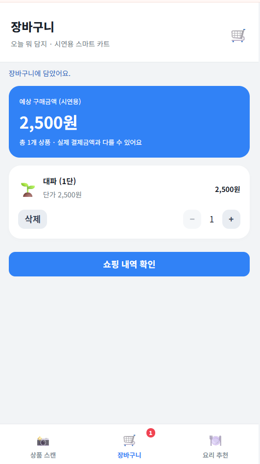
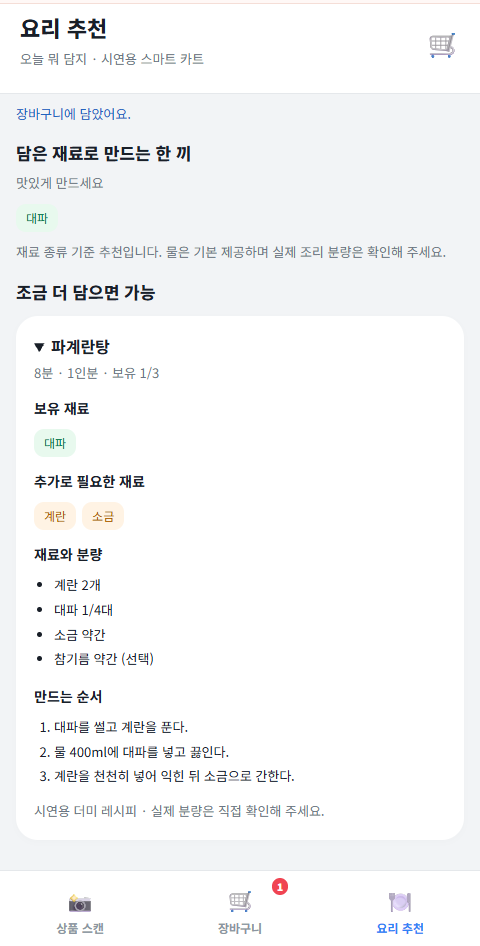
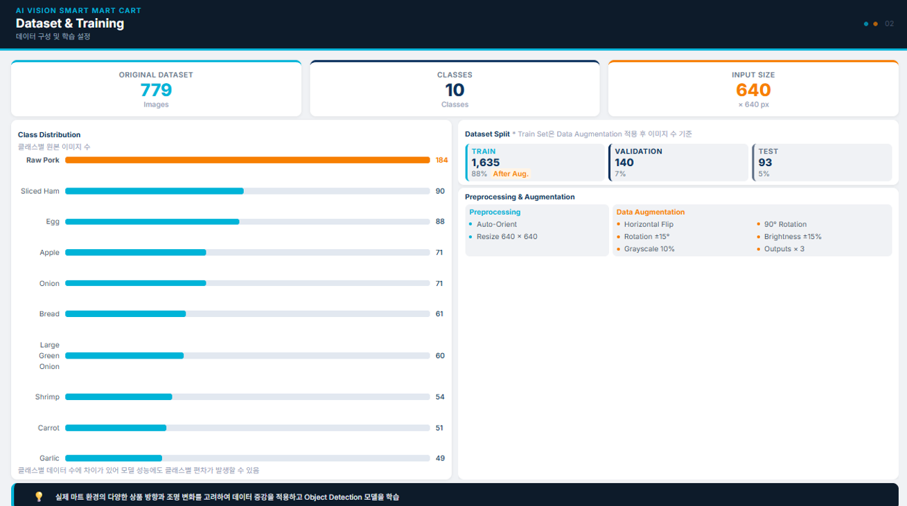
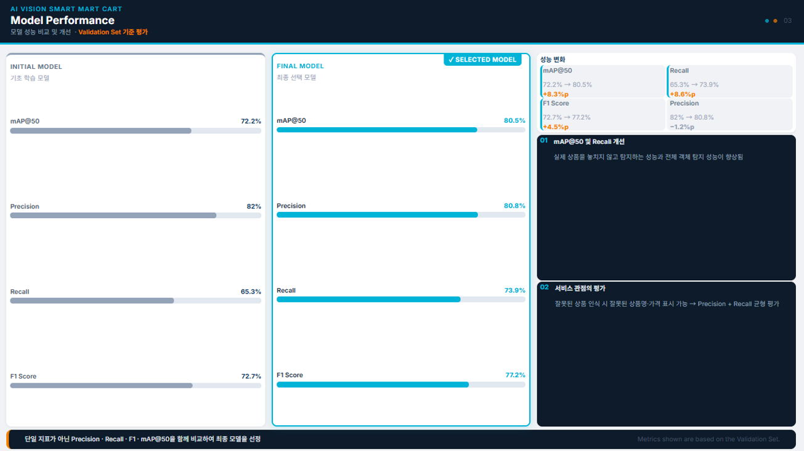
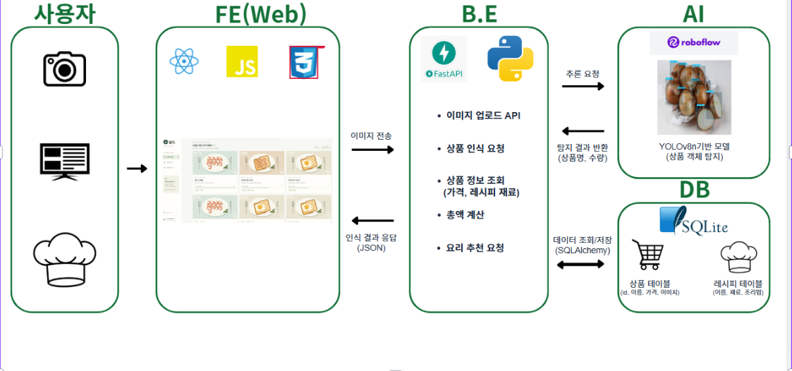

# 오늘 뭐 담지

카메라로 재료를 인식해 장바구니에 담고, 예상 금액과 재료 기반 요리를 확인하는 스마트 카트입니다.

# 화면





- React + TypeScript + Vite
- FastAPI + SQLite
- 브라우저(접속 기기) 카메라 / Roboflow 객체 탐지
- 상품 25종, 더미 레시피 14종
- Swagger: 실행 후 <http://localhost:4000/docs>


## Roboflow 모델 평가




### 왜 Recall보다 Precision을 더 보는지

**모델이 뭔가 놓치는 것보다, 틀린 걸 자신 있게 우기는 쪽이 더 위험합니다.**

카메라가 상품을 인식해도 바로 담기지 않습니다. 일단 "인식 후보"로 띄워주고 사용자가 확인한 뒤에 담는 구조입니다.

- **후보를 놓치면(Recall↓)** — 다시 스캔하거나 직접 골라 담으면 그만, 장바구니엔 영향 없음

- **후보가 확신 있게 틀리면(Precision↓)** — 사용자가 대충 확인하고 그대로 눌러서 엉뚱한 상품이 담길 수 있음

그래서 모델을 고르거나 `CONFIDENCE_THRESHOLD` 값을 정할 때는 Recall보다 클래스별 **Precision을 먼저** 봅니다.

그러므로 
스크린샷에서 평균 정밀도(mAP@50)가 72.2% → 80.5%로 가장 크게 오른 모델을 최종으로 선택했습니다.

### 그레이스케일 증강을 뺀 이유

**색 자체가 클래스를 구분하는 핵심 단서라서, 흑백으로 바꾸면 오히려 더 헷갈립니다.**

사과(빨강), 당근(주황), 마늘·양파(흰색), 돼지고기·슬라이스햄·새우(붉은 계열)처럼 이 데이터셋은 색으로 구분되는 식재료가 많습니다. 그레이스케일을 쓰면 이 색 정보가 사라져서, 모양은 비슷한데 색만 다른 클래스(마늘 vs 양파 같은)가 더 헷갈리게 됩니다. 그래서 2번째 모델링에서는 제외 했습니다. 


## 아키텍처



## 실행 환경

검증 환경은 Windows, Python 3.12, Node 24, pnpm 10.34.3입니다. Node 22를 사용하는 경우 Vite 8이 지원하는 22.12 이상을 사용하세요. Python 및 Node/pnpm 실행 파일이 PATH에 있어야 합니다.

## Windows에서 Node·pnpm 준비

`node` 또는 `pnpm`이 인식되지 않으면 먼저 [Node.js 공식 다운로드](https://nodejs.org/en/download)에서 Node 24 LTS를 설치하고 PATH 등록 옵션을 사용하세요. 설치 후 VS Code를 완전히 종료했다가 다시 실행하세요.

PowerShell에서 프로젝트 지정 버전의 pnpm을 설치합니다.

```powershell
node --version
npm.cmd install --global pnpm@10.34.3
pnpm.cmd --version
```

현재 터미널에서 새 사용자 PATH를 반영하려면 다음 명령을 실행하세요.

```powershell
$env:Path = [Environment]::GetEnvironmentVariable('Path', 'User') + ';' + [Environment]::GetEnvironmentVariable('Path', 'Machine')
```

Windows 안내에서는 `pnpm.cmd`를 사용합니다. PowerShell 실행 정책이 `Restricted`여도 실행 정책 변경 없이 CMD 실행 파일을 호출할 수 있습니다. macOS·Linux에서는 `pnpm`을 사용하세요. [pnpm 공식 설치 안내](https://pnpm.io/installation)

## 백엔드 실행

PowerShell 터미널에서:

```powershell
cd backend
python -m venv .venv
.\.venv\Scripts\python.exe -m pip install -r requirements.lock.txt
Copy-Item .env.example .env
.\.venv\Scripts\python.exe -m uvicorn app.main:app --env-file .env --host 127.0.0.1 --port 4000
```

기존 `.env`가 있으면 복사하지 말고 필요한 설정만 반영하세요. 예제 환경은 `DEMO_MODE=true`로 외부 모델과 실제 카메라 없이 전체 흐름을 확인할 수 있습니다. `.env`를 로드하지 않은 기본 실행은 실제 인식 모드이며, 이 경우 브라우저에서 카메라 사용을 허용해야 스캔할 수 있습니다.

## 프론트 실행

다른 PowerShell 터미널에서:

```powershell
cd frontend
pnpm.cmd install --frozen-lockfile
pnpm.cmd dev
```

<http://localhost:8443>에서 쇼핑을 시작하세요. `/api`는 백엔드 4000번 포트로 프록시됩니다. 다른 서버를 사용하면 `VITE_API_BASE_URL`을 지정하고 백엔드 `CORS_ORIGINS`에 프론트 주소를 등록하세요.

## 테스트와 결과 기록

프로젝트 루트에서:

```powershell
backend\.venv\Scripts\python.exe scripts/test_report.py F07-integration
backend\.venv\Scripts\python.exe scripts/test_report.py F03-cart tests/test_cart.py
```

실제 결과가 `docs/test-results/<기능명>.md`에 누적됩니다. 실패 이력도 보존합니다. 기능 구현·pytest·결과 MD·Swagger 반영 후 기능 단위로 커밋합니다.

프론트 검사 및 브라우저 통합 테스트:

```powershell
cd frontend
pnpm.cmd typecheck
pnpm.cmd build
pnpm.cmd exec playwright install chromium
pnpm.cmd test:e2e
```

설치된 Chrome을 사용하려면 `BROWSER_CHANNEL=chrome`을 환경변수로 지정할 수 있습니다. 브라우저 테스트는 4011·8445 포트에 테스트 서버를 자동 실행하고 임시 SQLite와 더미 영상으로 검증한 후 서버를 종료합니다. 포트가 이미 사용 중이면 해당 테스트 서버를 시작할 수 없습니다. 기본 Python 경로는 `backend/.venv`이며 `BACKEND_PYTHON`으로 변경할 수 있습니다.


## 문서

- [구현 기획서](docs/implementation-plan.md)
- [백엔드 API 및 운영 안내](backend/README.md)
- [OpenAPI 명세](docs/openapi.json)
- [개발·검증 결과](docs/implementation-status.md)
- [pytest 전체 결과](docs/test-results/F07-integration.md)
- [브라우저 통합 결과](docs/test-results/F07-browser.md)
- [트러블슈팅](docs/트러블슈팅.md)
- [Roboflow 데이터셋 설정 권장안](docs/로보플로우-데이터셋-설정.md)
- [Roboflow Test set 평가 결과](docs/test-results/roboflow-test-eval.md) ([시각화 노트북](docs/test-results/roboflow-test-eval.ipynb), `scripts/evaluate_roboflow_models.py`로 재생성)

